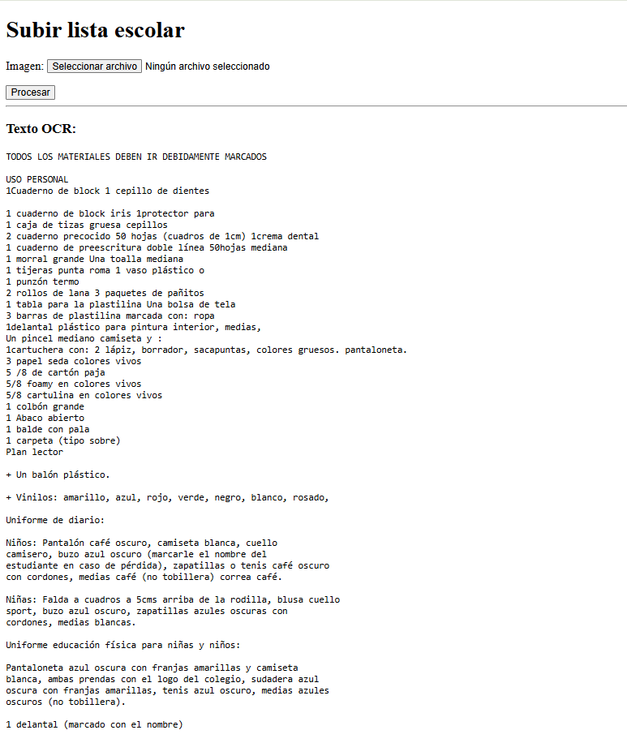
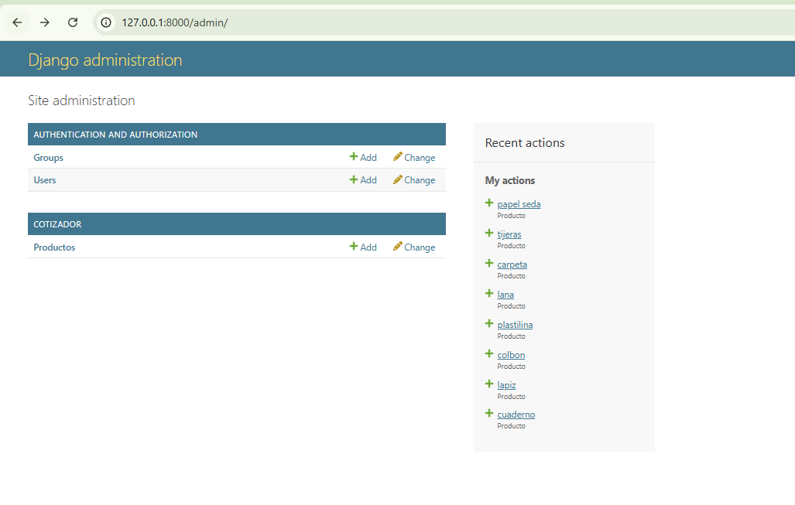

# 🚀 Cotizador Escolar - Django App

---

## 📌 Descripción

Aplicación web desarrollada con Django que permite realizar cotizaciones escolares de manera rápida y sencilla.  
Incluye un sistema de administración, formulario interactivo y visualización de resultados.

---

## 🎯 Objetivos del Proyecto

- Aplicar el patrón MVT de Django
- Implementar formularios dinámicos
- Gestionar datos mediante el panel admin
- Mostrar resultados en el frontend

---

## 🖥️ Vistas del Sistema

### 🏠 Página Principal

---

### 🔐 Panel de Administración

---

## ⚙️ Tecnologías Utilizadas

- 🐍 Python 3
- 🌐 Django 6
- 🗄️ SQLite
- 🎨 HTML (Templates Django)

---

## 📂 Estructura del Proyecto

presupuesto_escolar/
│
├── config/ # Configuración del proyecto
├── cotizador/ # App principal
│ ├── models.py
│ ├── views.py
│ ├── forms.py
│ ├── urls.py
│ └── templates/
│
├── db.sqlite3
├── manage.py
└── README.md